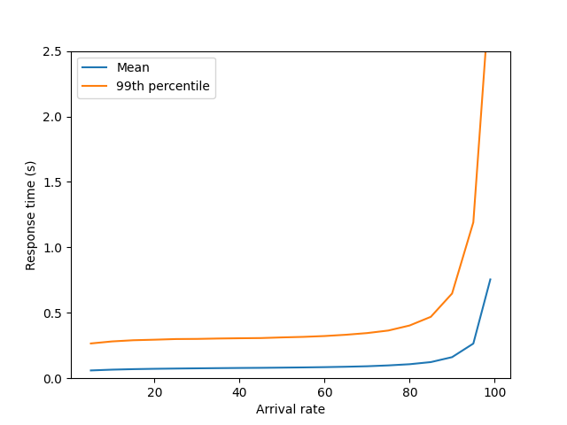

Lab report: Server farms and load balancing
===========================================

> [!NOTE]
> Write your report in this document. You can write it in English or French

Results table
-------------

Fill out the table below to record the simulation results.

Response times (99th percentile) in milliseconds:

| Case                      | 10% utilization | 80% utilization | 90% utilization | 
|---------------------------|----------------:|----------------:|----------------:|
| Case 1: M/M/1             |         51 ms        |       238 ms         |        506 ms        |
| Case 2: 5 servers, RR     |         232 ms       |       711 ms         |       1'428 ms       |
| Case 3: 6 servers, overd. |         229 ms       |       440 ms         |       592 ms         |
| Case 4: 5 servers, SFQ    |         281 ms       |       403 ms         |       647 ms         |
| Case 4: 5 servers, CQ     |         232 ms       |       761 ms         |       1307 ms        |

Case 1: Base scenario: M/M/1 system
-----------------------------------

Insert the response time plot (mean and 99th percentile) for different utilization levels.

Answer the following questions:

- How does the mean response time change with the load?

The mean response time increases throughout the test. At 70% of utilisation, the growth becomes exponential.

- How does the 99th percentile change with the load? 

The 99th percentile evolves the same way and it is 5 times higher than the mean response time.

Case 2: Load balancing with Round-Robin
---------------------------------------

Insert the response time plot (mean and 99th percentile) for different utilization levels.

Asnwer the following questions:

- Is this system a M/M/k system? Explain why.

No it is not. A M/M/k system works differently. For example, in a M/M/k system tasks are assigned to the next server available which is not the case with the Round-Robin policy. Eache server has its own queue here so this case looks more like a k * M/M/1 system.

- How do the mean response time and the 99th percentile change with the load?

Response times are increasing like in the first case and in the end the increase becomes exponential. The difference with the first case is that response times are a bit higher.

- Compare the 99th percentile with the M/M/1 system at a low utilization level (e.g., 10%). What do you observe?

We can observe that response time is nearly five times higher than in M/M/1 system. It matches with what we discussed in class about the k * M/M/1 system.

- Compare the 99th percentile with the M/M/1 system at a hight utilization level (e.g., 90%). What do you observe?

As well as the previous question, the response time is higher than M/M/1 but this time the gap is less than five times bigger. The number of requests must alterate the behaviour of the load balancing because it should be around five times bigger.

- Why is the performance of the load balancing system worse than M/M/1 at low utilization levels?

Because we have our number of servers that multiplies the response time.

- Why is the performance of the load balancing system worse tha M/M/1 at high utilization levels?

Same conclusion as the question before here. K factor remains but with less impact as we can observe.

Case 3: Overdimensioning RR
---------------------------

In case 2 we've simulated a load balancing system where each servers has 1/5 of the capacity of the single server in the M/M/1 system. We've observed that the load balancing system is less efficient.

How many servers are needed, such that the load balancing system has the same 99th percentile response time as the M/M/1 system at 90% utilization?

In my case the difference between RR and M/M/1 is closer with 6 servers than with 7 servers.

Show the plot with the response times for this configuration here and interpret the results.

Increasing the number of servers improves the performance of the load balancing system for *high loads*. Is it possible to improve the performance for *low loads* as well?

No it's not possible, at a low load level it's like comparing 2 servers directly. One with 20 service rate and the other with 100 service rate. The second server will always win.

Case 4: Improving the load balancing system
------------------------------------------

Describe the results obtained from the two algorithms (shortest-queue-first and central queue). How do they compare with the round-robin scheduling and with the M/M/1 system?

### SQF graph

### CQ graph

In both cases the M/M/1 is faster at low loads and the RR remains the slowest at all levels.

The SQF is slower than RR at lower loads but becomes more efficient thanks to the intelligence of the algorithm. It distributes the tasks to the shortest queue so the queues don't get overloaded when a task is bigger than others. 

On the other hand we have the central queue that represents a M/M/k system. This one is even with M/M/1 system at higher loads as we have seen during our class. In this lab I couldn't manage to represent it correctly but the response time at 90% should be similar to the M/M/1.

Case 5: Mixing servers
----------------------

This case considers a mix of a fast and slower server. 

Provide your answers to the questions for the mixed server configuration.

- If you only consider the throughput, which configuration is better: only the fast server, or both servers?

The better configuration is the one with two servers. With one server the service rate is at 100 requests per second while in the other case the service rate is 120 requests per second.

- Can you find a configuration where the response time is better with only the fast server?

Yes when the load level is low. When the arrival rate is low, the fast server alone can handle all requests without forming a queue. Adding a slow server can sometimes increase response times due to task assignment.

- Can you find a configuration where the response time is better with both servers?

Yes when the load level is high. When the load exceeds the fast server's capacity, queues form, and response times increase. Adding a second server reduces the load on the fast server, even though the second server is slower.

Conclusion
----------

Document your conclusions here. What did you learn from the simulation results?

This lab has been important for understanding load blancing systems, algorithms and their influence on system performance.

I learnt that while adding more servers increases the overall throughput of the system, it does not always lead to better response times. In addition, I learnt the impact of an intelligent policy when we are using various servers.

To conclude, I would say that the intersting thing I observed is the fifth case when a single server outperforms a mixed configuration at low loads due to its simplicity and lack of task distribution overhead. While at high loads, a mixed configuration with a fast and slower server improves response times by reducing the queue length for the fast server, leveraging the combined capacity of both servers.